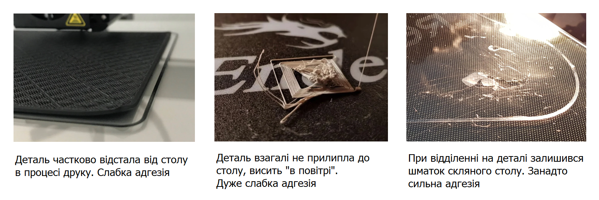
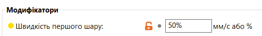
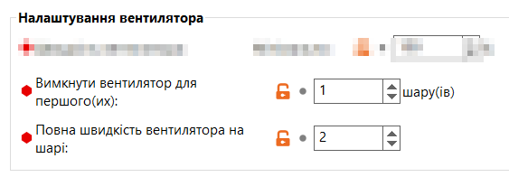
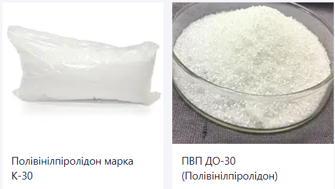
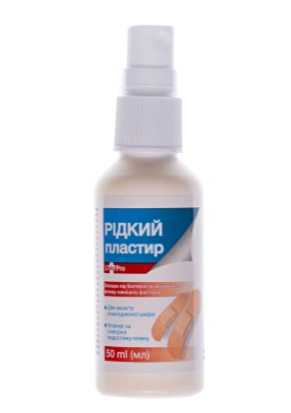
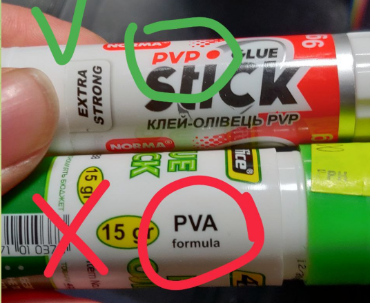
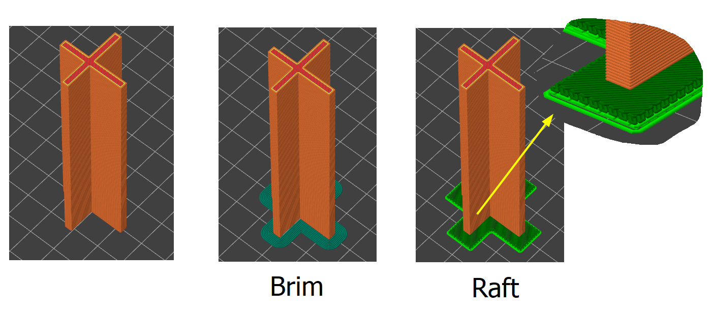

# Як покращити адгезію (прилипання)

> [!WARNING]  
> DISCLAIMER: Все, що описано в даній статті не є взірцем дотримання
> всіх технічних, соціальних і моральних правил та норм.
> Автор висловлює власну точку зору, яку пізнає в процесі експериментів. Я попередив.

## Що таке Адгезія

Адгезія - це прилипання двох різних поверхонь одна до одної. У світі 3D-друку, адгезія відіграє ключову роль у тому, як виріб з'єднується із робочим столом принтера під час друку. Відмінне прилипання забезпечує стабільність виробу, запобігає його деформації і допомагає уникнути зміщень та інших дефектів.

Степінь адгезії можна розділити на два основні типи: слабку та сильну.

- **Слабка адгезія** — це коли об'єкт недостатньо добре прилипає до столу, що може призвести до його зміщення під час друку. Проблеми: зміщення об'єкта може зіпсувати весь друкований виріб. Це може відбутися через деформацію, відслоєння країв або навіть повне відокремлення виробу від столу.
- **Сильна адгезія** - це коли об'єкт занадто сильно прилипає до столу, що ускладнює його безпечне відділення після друку.
Проблеми: занадто сильна адгезія може призвести до пошкодження столу або виробу під час спроб його відділити.

Для оптимального 3D-друку **потрібна золота середина** між слабкою та сильною адгезією: забезпечити достатнє прилипання виробу до столу, щоб він залишався стабільним під час друку, але не настільки сильним, щоб уникнути проблем при його відділенні.

## Що впливає на адгезію (теорія)

- **Тип поверхні столу**: матеріал та текстура поверхні столу (наприклад, скло, магнітний коврик / PEI, ультрабаза, метал) суттєво впливають на результат
- **Матеріал друку**: різні типи філаменту (наприклад, PLA, ABS, PETG) мають різний коефіцієнт прилипання до поверхні столу.
- **Температура столу**: на підігрітому столі пластик краще прилипає. Оптимальна температура залежить від типу пластику. Зазвичай ми друкуємо зі однаковими налаштуваннями, але майте на увазі, якщо експериментуєте з температурою столу
- **Температура екструдера**: чим вища температура, тим сильніше прилипає
- **Висота першого шару**: чим ближче до столу сопло на 1 слої, тим краще пластик "вдавлюється" в стіл і деталь прилипає
- **Швидкість друку**: Швидке нанесення першого шару може зменшити його прилипання до столу
- **Адгезивні агенти**: Використання спеціальних клеїв, спреїв може значно підвищити прилипання.
- **Калібрування столу**: Нерівний стіл або неправильне калібрування може призвести до нерівномірного прилипання
- **Охолодження**: наявність або відсутність активного охолодження, а також інтенсивність охолодження під час друку, може впливати на прилипання матеріалу.
- **Дизайн деталі**: широкі та плоскі елементи можуть мати тенденцію до відривання країв, вимагаючи кращої адгезії. Деталі з більшою площею контакту зі столу краще прилипають.
- **Чистота столу:** наявність бруду, пилу або жирів на столі може знизити адгезію.

## Що впливає на адгезію (практика)

Але не все зі списку вище можна змінити, наприклад **тип поверхні столу** ми не зможемо легко змінити, **матеріал друку** нам дано в ТЗ. **Температуру екструдера** ми виставляємо, щоб деталь була міцна, а не думаємо як вона прилипне. А **висоту першого шару** калібруємо, щоб не було дефекту, що називається "слонова нога". Тому пропоную пару практичних порад на прикладі PLA, які ви можете взяти як основу, а потім міняти в залежності від ваших потреб і звичок.

### PLA: як це роблю я

- Рекомендую друкувати на магнітному коврику - його можна зняти, він гнеться, а тому деталі легко відділити. Коврики довговічні, моїм комплектним з `Ender 3` вже 3-4 місяця, по вигляду рік мають прослужити.
- Якщо після друку почекати, поки стіл охолоне, то відстає легше. Порада дієва, але інколи я нею нехтую (спішу)
- Температура столу 60° (ніколи не міняю), температура хотенда 210° (плюс мінус можу міняти в залежнсті від виробника і необхідності покращити спікання пластика)
- (якщо у вас не PEI або інше покриття, яке з "заводу" не потребує підготовки) Стіл мазати адгезивом: так захищається коврик (довше прослужить). Нижче написано чим мазати. Да, можна друкувати на коврику без адгезиву, просто промивши водою з милом чи протерши ізопропилом, я так пробував, все ок. Але в комюніті скидали фото - люди умудрялися ушатати коврики за 2 тижні.
- Швидкість друку першого шару в слайсері - `50%`.

- Обдув вимикаю для 1-го слоя, так пластик краще лягає на стіл і прилипає.

- Коли знімаю деталі, то стараюся стіл пальцями не мацати, використовую шпатель

Крім вищевказаного, є варіант налаштувати в слайсері температуру першого шару на 5-10 градусів вище норми, але в мене проблем з адгезією PLA немає, тому я цього не робив. І взагалі, з PLA більша пробема, що він занадто сильно прилипає, тому адгезив рятує.

### Інші філаменти

Зараз я друкую PLA, хоча експериментував із PETG. Щодо інших типів філаменту, я не буду надавати рекомендацій у цьому тексті, доки не отримаю більше практичного досвіду з ними.

## Адгезиви

Адгезивів для забезпечення адгезії в 3D-друку існує багато. Вони варіюються від простих домашніх засобів до спеціалізованих комерційних рішень. Опис усіх можливих адгезивів був би надто надлишковим для новачка. Замість цього цього, пропоную ті, які виявилися найефективнішими для матеріалів, таких як PLA і PETG/coPET.
Якщо ви друкуєте іншии матеріалами, ви явно знаєте більше за мене і ця стаття не для вас.

Окрема тема це PEI (або схожі покриття), вони не требуєть адгезивів. Просто мийте їх періодично водою з милом. Для всіх інших адгезив  наносити треба. Фавоитом серед комюніті зараз вважається **PVP (полівінілпіролідон або повідон)**. Перевірено, працює відмінно, та ще й змивається водою. Варіанти:

### 1. PVP + спирт (ідеальний варіант)

Розчин 7.5г повідону в спирту. Продаєься у вигляді порошку. Розчиняється доволі повільно - гарно мішати (трусити в пляшечці), можна залишити на пару годин для повного розчинення.

Продається на Prom.ua, бачим найменшу кількісті - 100 грам. пару ссилок:

- https://lubny.prom.ua/ua/p928067603-povidon-polivinilpirrolidon-100g.html
- https://shop.hlr.ua/ua/polivinilpirrolidon-marka-k-30-98380.html
- Пошук (якщо ссилки не працюватимуть) https://prom.ua/ua/search?search_term=%D0%BF%D0%BE%D0%BB%D1%96%D0%B2%D1%96%D0%BD%D1%96%D0%BB%D0%BF%D1%96%D1%80%D0%BE%D0%BB%D1%96%D0%B4%D0%BE%D0%BD

### 2. Рідкий пластир з АТБ (мій варіант)

Це той же самий PVP розчинений в спирту, може бути з якимись добавками. Перевірено, працює відмінно. 1 бутилочки хватає на 3-5 місяців.

Готовий розчин краще наносити на холодний стіл. Я використовую шматок візкозної серветки для посуди, можна використовувати будь що, що не дає ворсини (наприклад, вата не підходить), або і навіть пшикати з бутилочки з розпилювачем - хто як хоче так і робить.

Мій варіант, тому що купив кілька штук і їх вистачить на пару років. Продається:

- В мережі АТБ
- https://tabletki.ua/uk/%D0%9B%D0%B5%D0%BA%D0%BE%D0%9F%D1%80%D0%BE-%D0%96%D0%B8%D0%B4%D0%BA%D0%B8%D0%B9-%D0%BF%D0%BB%D0%B0%D1%81%D1%82%D1%8B%D1%80%D1%8C/1035676/ 

### 3. Клей-олівець

Клей-олівець з надписом PVP (не PVA). Мені його наносити не так зручно, але теж робочий варіант і багатьом подобається. Слой виходить більш товстішим. Навідміну від попередніх варіантів, клей-олівець наносити краще на прогрітий стіл

По відгукам, клеї від різних виробників можуть працювати по різному (одні краще липнуть, інші гірше). Продається в будь-якому канцелярському магазині, але звертайте увагу на склад - має бути вказано `PVP` (бо вони є ще `PVA`, до нього не прилипає взагалі):

## Перший слой

У процесі 3D-друку основна деталь спочатку фіксується на робочому столі, тому перший шар пластика, який безпосередньо контактує із столом, відіграє ключову роль. Від його якості часто залежить успіх всього друкованого об'єкта, і саме з цієї причини йому приділяється особлива увага.

Після придбання 3D-принтера, а також періодино, важливо проводити калібрування стола, зокрема його рівень і положення відносно сопла (Z-offset).

> TODO: Доповнити з посиланнями на калібровки

## Програмні методи збільшення адгезії

Окрім фізичних методів регулювання адгезії, існують також програмні рішення, які дозволяють оптимізувати прилипання деталей до стола. Ці параметри налаштовуються безпосередньо в слайсері під час підготовки моделі до друку.

- **Кайма (Brim)** - це додатковий шар, який наноситься навколо контуру деталі, розширюючи площу контакту зі столом і, відповідно, підвищуючи адгезію. Вона особливо корисна, коли площа контакту нижньої поверхні деталі є обмеженою або коли деталь має велику висоту, що збільшує ризик її відлипання від стола.
- **Пліт (Raft)** - це багатошарова структура, яка друкується під основною деталлю і служить як її підставка. Він створює рівну і стабільну поверхню для друку, забезпечуючи відмінне зчеплення зі столом. Пліт особливо корисний для деталей з нерівними або складними нижніми поверхнями, а також у ситуаціях, коли деталі можуть мати проблеми з адгезією.

Гарне відео по цій темі є в спільноті в розділі "Школа": https://www.youtube.com/watch?v=4zPh9DSyzcI 
