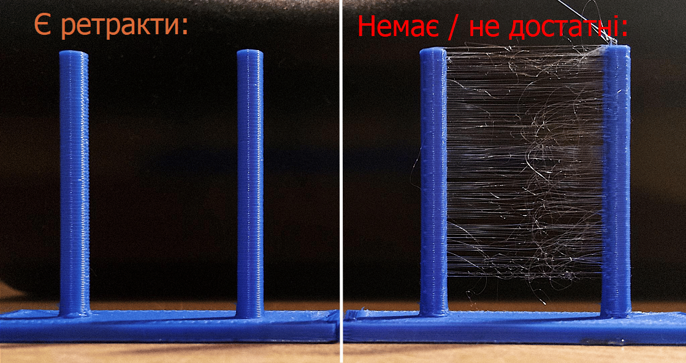
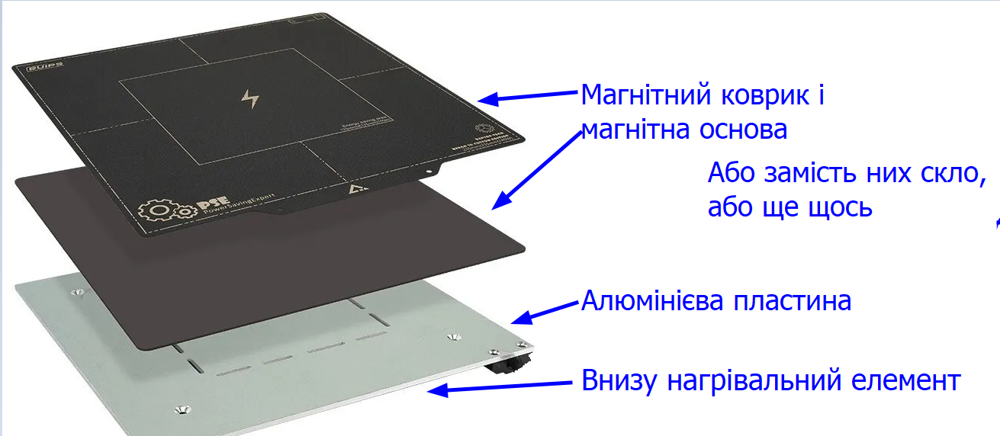
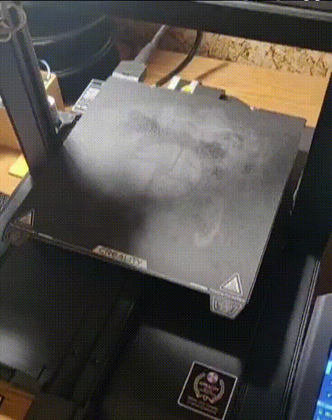
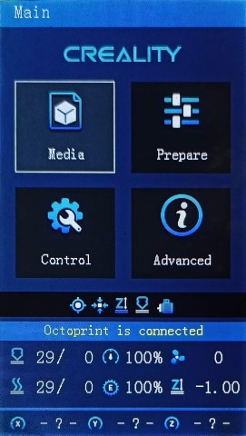
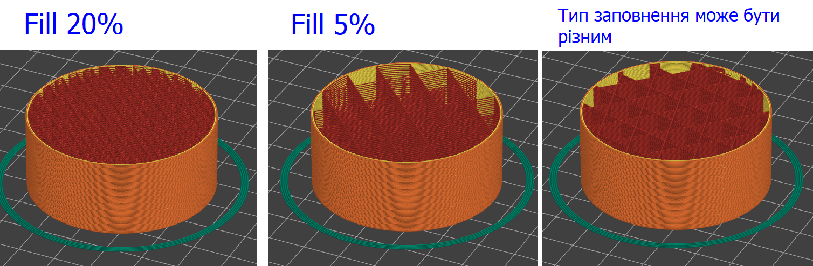
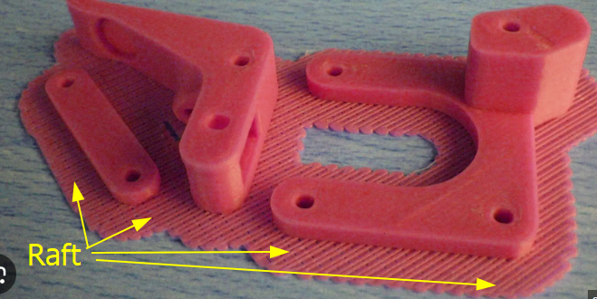
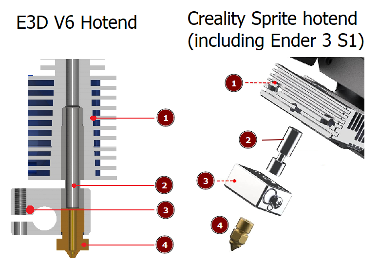
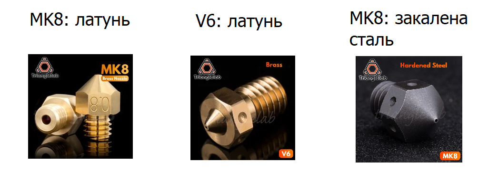

# Голосарій (список термінів)

- Для новачків
- Не цікаво для про

3D-друк має свій набір специфічних термінів та понять, що можуть здатися заплутаними для тих, хто тільки починає свій шлях у цій галузі.
Для того, щоб полегшити процес адаптації, пропоную до ознайомлення настуний список термінів.

## Філамент (Filament) або Нитка

Це пластикова нитка, що використовується для FDM 3D-друку. Зазвичай вона намотана на катушки масою від 0.5 до 3 кг. Найбільш поширений діаметр філаменту становить 1.75 мм.

## Резина (Resin)

Рідкий матеріал для 3D-принтерів на базі SLA (фотополімерного) друку.

## Ретракт (Retraction)

  
Показати

  Ретракт - це процес, при якому філамент втягується назад у екструдер під час переміщення головки принтера з одного місця на інше. Це робиться з метою запобігання небажаному "протіканню" розплавленого матеріалу, який може залишити небажані сліди або нитки на готовому виробі. Добре налаштований ретракт допомагає отримати чистіший і більш професійний вигляд друкованого об'єкта.

  

## Слайсинг (Slicing)

  
Показати

  Слайсинг - це ключовий процес у 3D-друку, який полягає в перетворенні 3D-моделі у послідовність шарів, які можуть бути "надрукованими" принтером. Це дозволяє 3D-принтеру відтворити об'єкт шар за шаром, починаючи знизу та просуваючись вгору.

  Програмне забезпечення для слайсингу бере 3D-модель у форматах, таких як STL або OBJ, і перетворює її у G-code — інструкції, які принтер виконує крок за кроком. Під час цього процесу користувач може вибирати різні параметри друку: висоту шару, швидкість друку, тип і розмір підтримок, заповнення, температуру екструдера та інше.

  Як на мене, слайсер (програма для слайсингу) це основний інструент друкаря, вивчити який потрібно досконало. Ось перелік найбільш поширених і улюблених в комюніти програм:

  - [Prusa Slicer](https://www.prusa3d.com/page/prusaslicer_424/) - безкоштовний, мій особистий вибір
  - [UltiMaker Cura](https://ultimaker.com/software/ultimaker-cura/) - шикарний слайсер, купа плагінів. Мій особистий вибір №2, який тільки починаю вивчати
  - [Orca Slicer](https://github.com/SoftFever/OrcaSlicer) - безкоштовний, заснований на Prusa Slicer

## PLA, ABS, PETG, TPU

  
Показати

  Ці абревіатури представляють собою різні типи філаментів, які використовуються в 3D-друку.

  - **PLA**: Біорозкладний та екологічно безпечний пластик, який отримують з рослинних ресурсів, зокрема, з кукурудзи. Він легкий у друку, має низьку температуру плавлення і часто використовується новачками. Не має запаху і не виділяє шкідливих речовин при друці, тому придатний для друку в будинку/квартирі.

  - **ABS**: Міцний пластик, який широко використовується в 3d друці. Механічно міцний, удароміцний, термостійкий, стійкий до розчинів лугів та кислот, спиртів, але і легко піддається як механічній, так і хімічній обробці, може бути пофарбований. Вимагає вищої температури плавлення, аніж **PLA**, і може виділяє запах під час друку (`S`- стирол).

  - **PETG / coPET**: Цей філамент поєднує найкращі властивості PLA та ABS. Він міцний, гнучкий і стійкий до ультрафіолетового випромінювання. Також відомий своєю хімічною стійкістю та прозорістю.

  - **TPU (Термопластичний поліуретан)**: Гнучкий філамент, який використовується для створення предметів, які потребують гнучкості. Цей матеріал здатний розтягуватися та стискатися.

  Кожен з цих філаментів має свої особливості, і це далеко не повний перелік. Детальніше: [типи філаментів](../filaments/index.md)

##  STL 

Формат файлу для 3D-моделей, який часто використовується для 3D-друку. Являє собою готову для друку стиснену модель, яку може відкрити будь-який слайсер

## Ліжко (Bed, Heatbed, Heated Bed) або Стіл

  
Показати

  Стіл в 3d-принтера під час друку підігрівається для кращої адгезії. На нього друкується деталь.

  Стіл може бути різної конструкції, зверху може бути як магнітний коврик, так і метал, скло, ультрабаза (скло із спеціальним покриттям), PEI і т.д. залежно від того яким пластиком ви друкуєте.

  Для PLA рекомендую гнучні магнітні коврики - вони довговічні і з них легко знімати деталі.

  Типовий стіл на бюджетному принтері може виглядати так:

  

## Дрига, дригостіл

Так називають будь-який принтер, типу Prusa або Ender, в яких рухається стіл під час друку.

  
Показати gif

  

## G-код (G-code)

  
Показати

  Це інструкції або "рецепт", за допомогою якого 3D-принтери, фрезерні станки та інше обладнання знають, як і де рухатися, щоб створити об'єкт або виріб. Коли ви хочете надрукувати щось на 3D-принтері, ваша 3D-модель в слайсері перетворюється на G-код. Цей G-код потім "читається" принтером, і він точно знає, де розмістити пластик, щоб створити ваш друкований об'єкт.

  - [Marlin G-codes](https://marlinfw.org/meta/gcode/)

## Марлін (Marlin)

  
Показати

  Найпопулярніша прошивка для 3д-принтерів [https://marlinfw.org/].
  Інтерфейс може відрізнятися в залежності від виробника (наприклад Flying Bear непонятно для чого міняють вигляд, брендують), ось фото як меню типово виглядає:

  

## Заповнення (Infill)

  
Показати

  Заповнення відноситься до внутрішньої структури друкованої деталі. Його можна уявити як "скелет" або "решітку" всередині об'єкта. Різні шаблони заповнення дозволяють користувачеві вибирати оптимальний баланс між міцністю виробу та витратами пластикової нитки. Щільніше заповнення забезпечує більшу міцність деталі, але використовує більше матеріалу.

  

  Важливим параметром друку є **Щільність (величина) заповнення** \(**Infill Ratio** або **Fill density**\) — відсоток внутрішнього простору 3D-друкованої деталі, який заповнено матеріалом. Вона вимірюється в відсотках та може варіюватися від 0% (повністю порожній внутрішній простір) до 100% (повністю заповнена деталь). Величина заповнення дозволяє користувачам вибирати компроміс між міцністю, вагою та вартістю друку. Наприклад, деталь із заповненням 20% буде легшою, швидше друкуватиметься та вимагатиме менше матеріалу порівняно з деталлю із заповненням 80%. Проте деталь із вищим відсотком заповнення, як правило, буде міцнішою.

## Пліт або Рафт (Raft)

  
Показати

  Рафт є додатковим шаром або платформою, яку 3D-принтер створює під основною деталлю на початковому етапі друку. Ця платформа допомагає виробам краще прилягати до столу принтера, зменшуючи ймовірність їх відлипання або спотворення під час друку.

  

   Prusa slicer: "Параметри друку" - "Підтримка" - "Пліт"

## Хотенд

  
Показати

  Це ключова частина 3D-принтера, де філамент нагрівається до плавлення, після чого виштовхується через сопло для створення 3D-моделі. Це, по суті, "плавильна" частина 3D-принтера.

  Може включати в себе в себе нагрівальний блок, радіатор з термобар'єром, сопло, термістор, нагрівальний елемент. 

  > 
  > 1. Радіатор
  > 2. Термобар'єр
  > 3. Нагрівальний блок із нагрівальним елементом та термістором
  > 4. Сопло

## Сопло (Nozzle)

  
Показати

  Кінцева частина головки 3D-принтера, через яку витікає розплавлений матеріал.

  Характеристики сопла:
  - **Модель**: конкретні дизайни сопел, які розроблені для певних конфігурацій хотендів 3D-принтерів. Приклади: `MK8` для Ender 3 S1, `V6` для Fleying Bear Ghost 6 і т.д
  - **Матеріал**: для `PLA`, `PETG/coPET`, `ABS` зазвичай використовують латунні, для композитів - стальні закалені. Також бувають мідні нікельовані, титанові і т.д.
  - **Діаметр отвору**: розмір отвору у соплі, зазвичай вимірюється в міліметрах (наприклад, 0.4 мм або 0.8 мм). Різний діаметр впливає на товщину витісненої лінії та швидкість друку. Зазвичай принтери комплектуються по замовчуванню сопами діаметром 0.4 мм.

  

## TODO: (в планах)

- Термобар'єр
- Силіконовий носок (Heated Block Silicone Sock)
- Каретка
- X, Y, Z
- Екструзія
- База (base)
- Дельта
- Core XY
- Слонова нога
- Direct
- Bowden
- Вирівнювання столу
- Калібровка
- PTFE трубка
- Мости
- Портал
- Подаючий механізм (інколи - фідер)
- Прошивка
- Висота слою
- Периметр
- Linear Advance
- Brim
- Підтримка (Support)
- Периметр або стінка
- Висота шару
- Skirt або плінтус
- Термістор (Thermistor)
