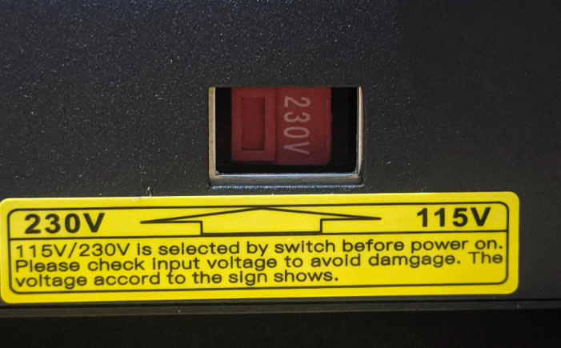

# Порядок калібровок принтера

## Відразу після покупки принтера

Відразу після покупки варто перевірити механіку та електрику принтера, впевнитися, що
все працює, не скрипить, не пищить і не стукає :) Отже, ви зібрали новий принтер по інструкції
і збираєтеся його вмикати.

### 1) Перевірка напруги блока живлення

На корпусі блока живлення є перемикач напруги із "220/230V" на "110/115V". Перевірте, щоб у вас було "220/230".



### 2) Перевірка механіки

- X, Y, Z вільно їздять, якщо рухати рукою. Нічого ні в якому місці не заклинює, осі рухають з однаковим зусиллям по всій їх довжині
- Каретка, стіл не шатаються
- Вмикаємо, рука на вимикачі живлення принтера: робимо парковку осей, всі кінцевики нормально спрацьовують. Дуже рекомендую подивитися як працює парковка, як вмикати конкретно ваш принтер
- Вмикаємо ручне керування, рухаємо всі осі вправо-вліво, вверх-них, вперед-назад, щоб упевнитися, що все правильно працює
- Вмикаємо нагрів столі і хотенда, перевіряємо, що йде нагрів
- Коли прогріється, можна перевірити вісь E (подачу філаменту). На принтерах стоїть захист: холодний хотенд не дозволить рухати вісь E, тому попередній пункт щодо прогріву необхідний
- Хотенд і стіл уже прогріті, якраз час перевірити, що вентилятори на радіаторі хотенду та вентилятор на блоці живлення працюють


## Основні налаштування

Якщо з механікою все в поряд, то можна приступати до основних налаштувань.

### 1) Прошивка принтера

Якщо для вашого принтера це необхідно.

### 2) Калібровка PID хотенда і стола

### 3) Калібровка кроків X, Y, Z

Перевіряється, що якщо подати команди типу "рухати вісь ... на 10 см", відповідна вісь дійсно рухається на указану відстань.

Тут буде корисна формула:

```
"Нове розширення" = ("текуче розширення" * "скільки мало б бути") / "скільки зараз"
```

### 4) Калібровка розширення екструдера (E)

Те саме, тільки для вісі E. Робиться шляхом часткового розбору хотенду, вимірюється чи правильну довжину
філаменту подає принтер.

`M302 S0` - вимкнути захист від подачі пластику на холодну.

Формула така сама, як і в попередньому пункті.

### 5) Калібровка рівня столі

### 6) Калібровка Z-offset (першого шару)

### 7) Калібровка Linear Advance під конкретний пластик

### 8) Калібровка відкатів (retraction) під конкретний пластик

### 9) Калібровка потоку під конкретний пластик

### 10) Калібровка температури друку (хотенду) під конкретний пластик


## Узагальнення

Linear Advance, відкати, потік і температура друку налаштовується під конкретний пластик.
Змінили виробника - створюємо новий профіль філаменту і налаштовуємо це.

Всі інші налаштування робляться тільки 1 раз, або коли з'являться якісь проблеми з друком.
Калібровка рівня столу варто робити хоча б пару раз в місяць.
Z-offset - при необхідності, зручно дивитися і правити на ходу поки друкується 1 шар.

Замінили тип термобар'єру або матеріал сопла - всі налаштування, починаючи із PID хотенда і стола.
