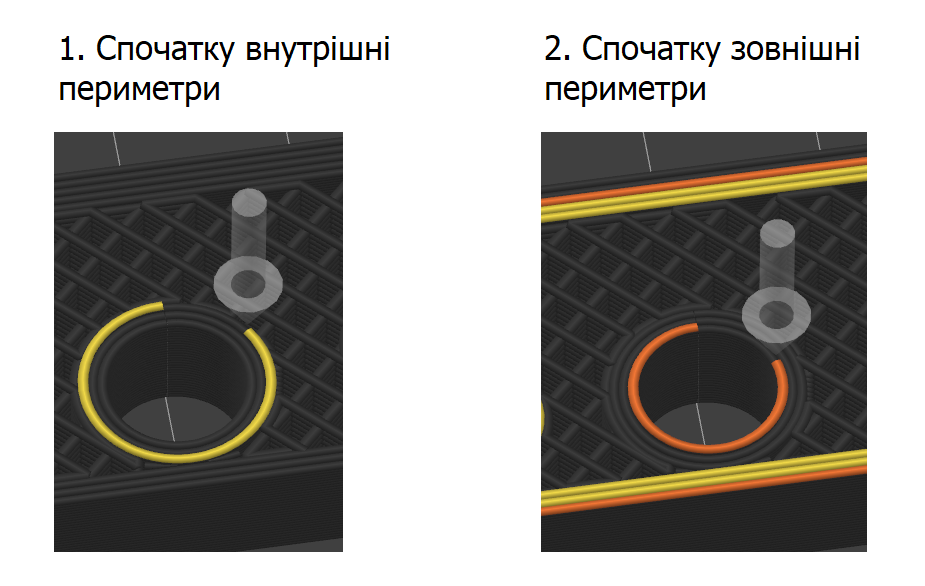
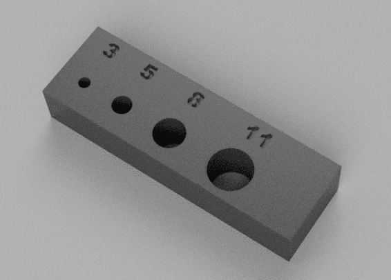
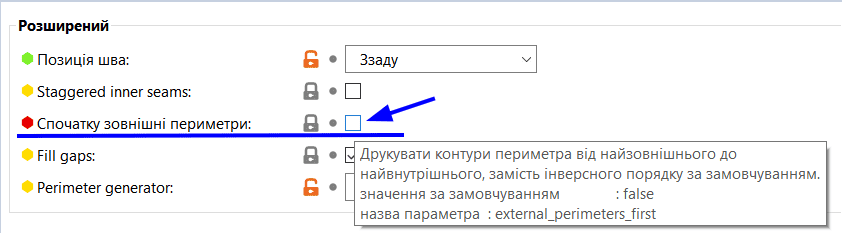
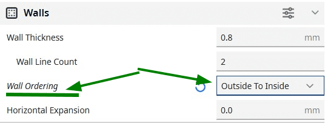
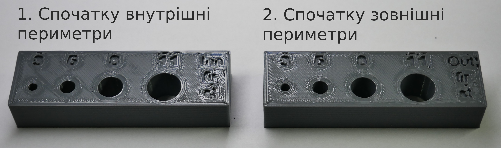
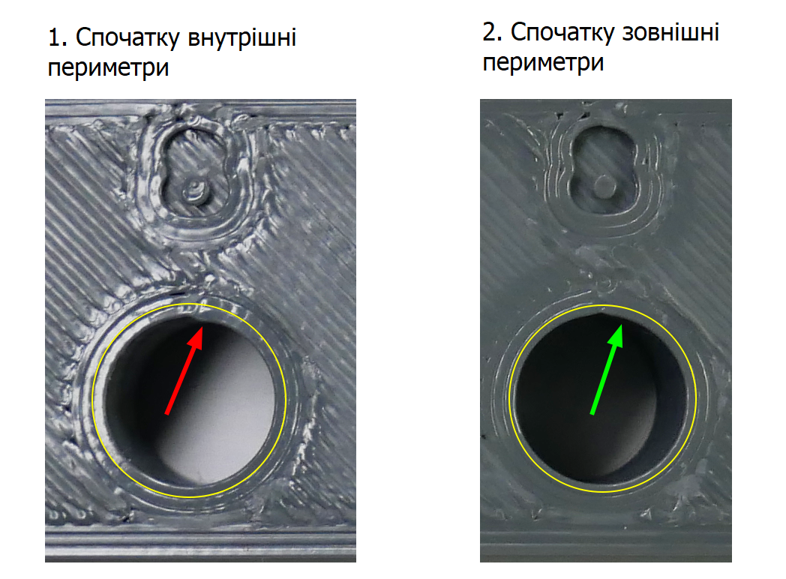
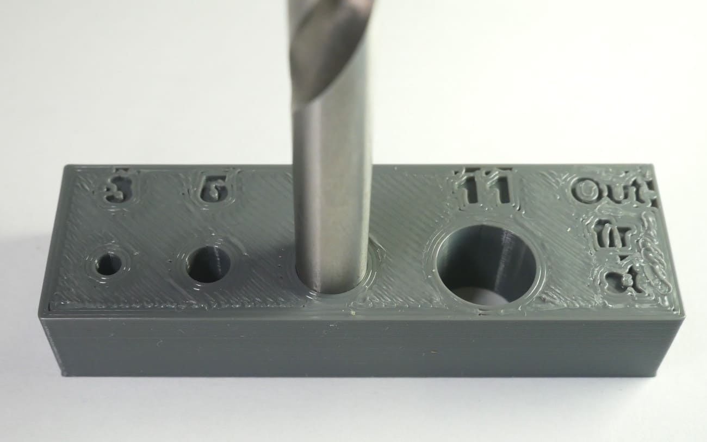
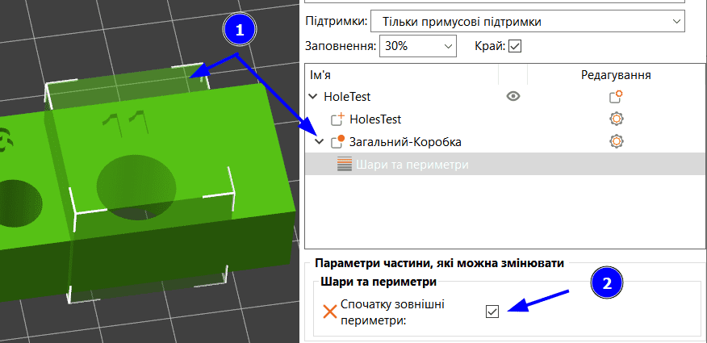

# Як друкувати отвори

У 3D друці, точність друку отворів важлива для якості кінцевих продуктів.
В отвори вставляються болтики, інші деталі, і ми, люди ліниві, хочемо
друкувати отвори в розмір, щоб не прийшлося їх доробляти надфілем чи свердлом.

> [!TIP]
> Важливо, що даний міні-гайд стосується звичайних отворів, а не різьб.
> Майте це на увазі, адже основна порада, що допоможе вам друкувати
> точніші отвори, зовсім не підходить для різьб!

## Експеримент із порядком друку периметрів

У слайсері є налаштування, яке відповідає за порядок друку периметрів. Перший варіант, що стоїть за замовчуванням в Prusa Slicer - спочатку друкувати внутрішні периметри, а потім зовнішні. Другий варіант (див. ілюстрацію нижче) це навпаки.

Зовнішні периметри, це ті, що розташовані ближче до краю отвору, їх видно,
якщо заглянути в отвір ;\)

Для друку отворів в інтернеті рекомендують використовувати саме 2 варіант - спочатку зовнішні периметри. Я вирішив перевірити експериментально, чи правда
це допоможе, чи це просто пусті рекомендації, які лише додадуть мені мороки.

Отже, дано:

- Один і той же принтер
- Один і той же філамент - Pochatok PLA
- Одні й ті ж налаштування принтера (Linear Advance, відкати, висота ліній, кількість периметрів і т.д.)
- Зробив просту  [тестову модель](./files/HolesTest.stl) в Fusion 360: це просто паралелепіпед з отворами 3мм., 5мм., 8мм, 11 мм. Модель в Fusion виглядає ось так:

## Тестові моделі

Я роздрукував відповідно два варіанти, які відрізняються лише порядком
друку периметрів, відповідно до найпершої ілюстрації. До речі, в Prusa Slicer це налаштування знаходиться в "Параметри друку" → "Шари та периметри" → "Розширений" → Чекбокс "Спочатку зовнішні периметри". По замовчуванню цей чекбокс вимкнений, я ввімкнув його для другого варіанту:

В слайсері **Ultimate Cura** те саме налаштування знаходиться тут:

А в мене вийшло дві деталі:

Вид зверху:

Шов в 2 варіанті виглядає краще, ось тут в повному розмірі видно місце,
де зліва виступає більша ґуля:

Внутрішня поверхня отвору в обох випадках вийшла гарною, крім шва, візуально
відрізнити не можна. А от різницю в швах з іншого ракурсу видно дуже гарно:

## Розміри отворів

Розміри отворів штангенциркулем міряти не дуже зручно, я зміряв кілька раз
вибрав середнє значення. Для отвору, що в моделі 8 мм:

| Спочатку внутрішні периметри | Спочатку зовнішні периметри |
| ---------------------------- | --------------------------- |
| 7.84 мм.                     | 7.95 мм.                    |

те, що отвір вийшов менший, чим 8 мм., це нормально - пластик в процесі
охолодження і під час друку від тиску сопла трохи розширюється.
А от різниця в `0.11` мм. вже виглядає цікаво.

Для більш правильної перевірки я знайшов свердло, в якого хвостовик 7.93 мм.

В 1 варіанті: свердло ледь зайшло на пару міліметрів силою. Далі запихати
не став, бо руками б е витягнув.

В 2 варіанті: свердло зайшло з невеликим зусиллям, на всю довжину.
Витягається також з невеликим зусиллям. Такий варіант мені подобається набагато більше

## Вплив переекструзії

ще одним фактором, що впливає на діаметри отворів, є переекструзія.
Якщо принтер лиє більше пластику, то йому нікуди діватися, він буде
утворювати лишні напливи всередині отвору, зменшуючи його діаметр.
Результати будуть гірші, якщо б була переекструзія 5-10-20%.
І чим менші отвори, тим менше місця, куди діватися лишньому пластику,
а відповідно й вплив переекструзії більший.

## Висновки

Використання налаштування "Спочатку зовнішні периметри"
разом з точним контролем переекструзії може значно підвищити якість
друку отворів. В дієвості першого налаштування я впевнився
за допомогою експерименту.

Відтепер я буду друкувати отвори вищеописаним способом номер 2.
Не обов'язково друкувати так всю деталь, краще залишити
по-замовчуванню, а на отвори добавляти модифікатори вручну,
в прюші вони знаходяться тут:

