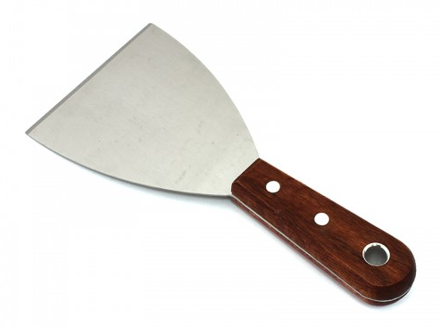
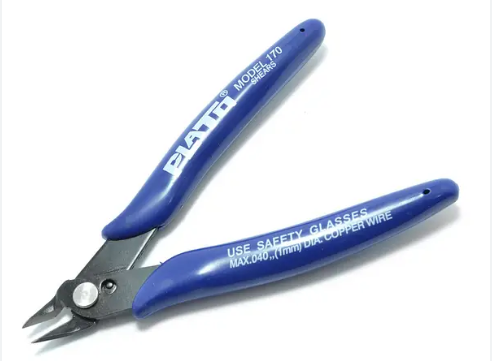
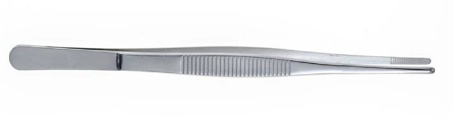
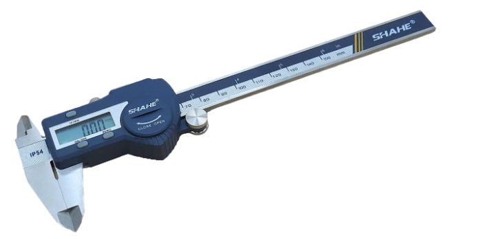
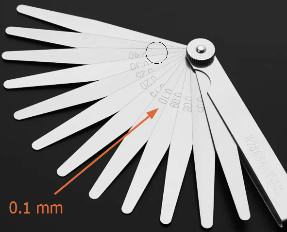
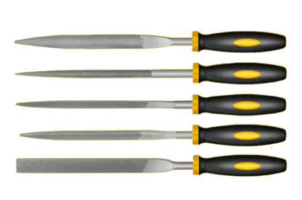
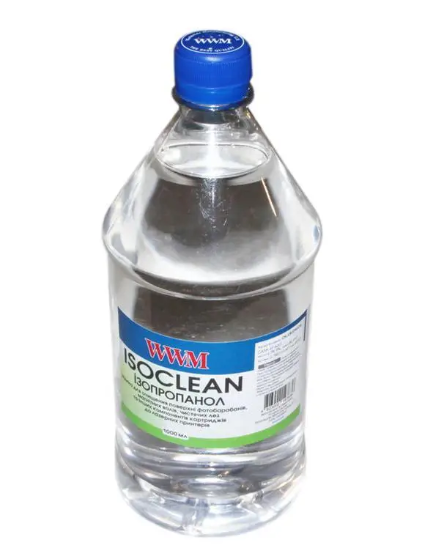

# Інструменти та розхідники

## Обов'язкові

Ці інструменти мають бути обов'язково в кожного друкаря.

### 1. Шпатель

Використовується для зняття друкованих об'єктів зі столу принтера. Має бути тонким і гострим,
так як тупим шпателем віддирати важко і нерідко зі шматками покриття столу.

- [Приклад](https://la-torta.ua/ua/shpatel-dlya-shokolada-10sm)

Можна використовувати той, що йде в комплекті з принтером,
якщо ви можете його акуратно заточити.
Я так зі своїм зробив, працює добре.

### 2. Кусачки для філаменту

Вони необхідні для чистого та акуратного обрізання філаменту, без них не обійтися.
Скоріше за все в комплекті до вашого принтеру вже є, тих комплектних хватає на
100%. Але раптом немає, ось посилання:

- [Aliexpress](https://www.aliexpress.com/item/1005004748524842.html?spm=a2g0o.productlist.main.7.4a641267rd5EGc&algo_pvid=71aaa9e7-ea7f-4dbe-9502-5867b71bf815&algo_exp_id=71aaa9e7-ea7f-4dbe-9502-5867b71bf815-3&pdp_npi=4%40dis%21UAH%21207.23%2182.97%21%21%215.62%21%21%402116617717010239744648475e364c%2112000030328747228%21sea%21UA%214115394399%21&curPageLogUid=eSP1y5imNE8u) за 83 грн.
- [Aliexpress пошук "nippers"](https://www.aliexpress.com/w/wholesale-nippers.html?spm=a2g0o.home.search.0)
- [Prom пошук "бокорізи"](https://prom.ua/ua/search?search_term=%D0%B1%D0%BE%D0%BA%D0%BE%D1%80%D1%96%D0%B7%D0%B8), шукайте такі як на фото

### 3. Пінцет

Пінцет для видалення дрібних надлишків філаменту, сміття із деталі та гарячого сопла.
Взагалі підійде любий: гострий, тупий, заокруглений і т.д.
Краще купіть 1 нормальний, а не якийсь набір 3-5-10 штук.

### 4. Штангенциркуль

Важливий для точних вимірювань деталей та перевірки точності друку.
Досить дорога покупка (~1400 грн), тому купуйте якщо знаєте, що ви з 3д друком надовго.
Ним можна заміряти як деталі, так і пруток.
Точність 0.02-0.03 мм. достатньо. За точніший переплачувати не має сенсу.
Довжина - 150 мм. достатньо.
Мій вибір - китайська фірма "Shahe", так як інструмент хороший за свої гроші.

- [Aliexpress Shahe 5101-150](https://www.aliexpress.com/item/1005002898744797.html?spm=a2g0o.store_pc_groupList.8148356.1.3e81751eIQeOCo&pdp_npi=4%40dis%21UAH%211%C2%A0686%2C20%20%D0%B3%D1%80%D0%BD.%211%C2%A0214%2C23%20%D0%B3%D1%80%D0%BD.%21%21%2145.73%2132.93%21%40211b88ec17010341253856091e9570%2112000033722191087%21sh%21UA%214115394399%21)
- [Prom пошук "Штангенциркуль електронний Shahe 150mm"](https://prom.ua/ua/search?search_term=%D0%A8%D1%82%D0%B0%D0%BD%D0%B3%D0%B5%D0%BD%D1%86%D0%B8%D1%80%D0%BA%D1%83%D0%BB%D1%8C%20%D0%B5%D0%BB%D0%B5%D0%BA%D1%82%D1%80%D0%BE%D0%BD%D0%BD%D0%B8%D0%B9%20Shahe%20150mm)

### 5. Щупи зазорів

Набір щупів — для калібрування прозору між столом та соплом.
Ними більш стабільно і правильно, чим "калібрування листочком А4".

- Продаються в автомагазинах
- [Prom пошук "щуп зазорів"](https://prom.ua/ua/search?search_term=%D0%A9%D1%83%D0%BF%20%D0%B7%D0%B0%D0%B7%D0%BE%D1%80%D1%96%D0%B2)
- [Aliexpress пошук "metric thickness feeler"](https://www.aliexpress.com/w/wholesale-metric-thickness-feeler.html?spm=a2g0o.productlist.search.0)

## Не обов'язкові

В цьому розділі я додам ще список із деяких інструментів та розхідників, якими я
особисто користуюся. Це не значить, що вам потрібно купувати все й одразу, можливо
ви тут знайдете відповідь на питання, що може полегшити роботу
друкаря. Це можна докупити по мірі необхідності.

### 1. Набір надфілів

Часто буває такий брак деталей, які можна поправити надфілями, а не викидати чи передруковувати деталь. Також, незамінна річ при відділені деяких підтримок, які можуть залишатися на деталі. Особливо добре піддається такій обробці PETG. Для мене найбільш ходові - круглі (поправити невеликі отвори), плоскі (для рівних поверхонь), квадратні (поправити кути).

Є сенс купити набір штук 4-6, коштують трішки більше 100 гривень.
Беріть не алмазні надфілі,а звичайні, вони виглядають як маленькі напильники.

- [Prom пошук](https://prom.ua/ua/search?search_term=INTERTOOL%20HT-3706)
- [Aliexpress пошук "set of needle files"](https://www.aliexpress.com/w/wholesale-set-of-needle-files.html?spm=a2g0o.productlist.search.0)

### 2. Спирт ізопропіловий

Надіюся ви пам'ятаєте уроки хімії, що пити ізопропіловий спирт не можна.
А от протирати стіл, мити сопла, обезжирювати поверхні підходить в самий раз.
Продається в різного розміру ємностях, 0.5-1 літра вистачить на довго.

- Продається як розчинник в будівельних магазинах ([епіцентр](https://epicentrk.ua/ua/shop/spirt-izopropilovyy-khimekspres-0-5-l.html))
- [Пошук на Prom](https://prom.ua/ua/search?search_term=%D1%81%D0%BF%D0%B8%D1%80%D1%82%20%D1%96%D0%B7%D0%BE%D0%BF%D1%80%D0%BE%D0%BF%D0%B8%D0%BB%D0%BE%D0%B2%D0%B8%D0%B9), вибирайте потрібну ємність

### 3. Сушарка для філаменту

Хоча філамент і пакується у вакуумні пакети, але під час виробництва може
бути вологим із заводу. Особливо, якщо купуєте філамент в наших Українських виробників.
PETG вбирає воду із повітря кімнати, і може бути, що за 1-2 дня висіння котушки
на тримачі принтера, він вже стане вологим. А, наприклад, нейлоном взагалі друкують
прямо із сушарки, так як він вбирає вологу за пару годин.
Вологий пластик - ворог, він робить наші деталь пористими, залишає нерівномірну поверхню,
тому сушарка друкарю рано чи пізно буде потрібна.

Я користуюся котушками в 1 кг., тому мені достатньо 1 маленької.
Є сушарки, де можна сушити кілька котушок одночасно, або одну велику на 3 кг.
В наших магазинах коштують х1.5 - х2 до ціни, що на Аліекспресс, тому варто замовити
і хай помаленьку їде.

Обов'язково, щоб регулювалася температура сушки, щоб можна було сушити і PETG, і PLA, й інші пластики.

- Мій вибір (не самий дешевший варіант) [Aliexpress SUNLU 3D Filament Dryer S2](https://www.aliexpress.com/item/1005004103458709.html?spm=a2g0o.order_list.order_list_main.178.22d31802Iuea8G)
- [Aliexpress пошук "Filament Dryer"](https://www.aliexpress.com/w/wholesale-Filament-Dryer.html?spm=a2g0o.detail.search.0)
